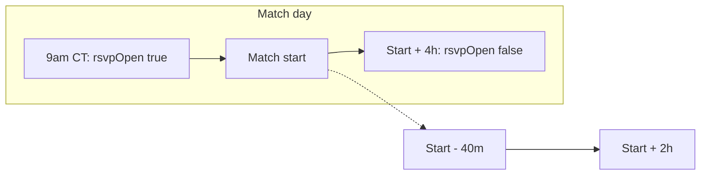

# Match Check-in + Attendance Stats

Plan for location-based match check-in and RSVP→attendance tracking. Points / RSVP priority are deferred to a later phase.

## Goals (v1)

- **Prerequisite:** Structured locations — admin enters **name** + **address**; we geocode to lat/lng for check-in; UI shows the **name** as a link that opens the device’s default maps app. **No embedded map.**
- Players tap **Check in** at the field; presence is recorded against their confirmed RSVP.
- Admins can manually mark attendance (fallback when GPS fails/denied).
- Profile shows simple **attendance stats**: RSVPs confirmed vs shows / no-shows.
- **Out of scope for v1:** points, RSVP priority, QR codes, native geofencing, embedded maps, dedicated no-show column/backfill.

## Todos

1. Change RSVP close to matchStart+4h; cron closes instead of deletes; hourly QStash; filter past matches out of `/matches`
2. Prerequisite: location `{name, address, lat, lng}`; admin name+address fields with geocode; clickable name opens device maps (no embedded map)
3. RSVP attendance fields; geo check-in (start−40m → start+2h) + admin host override APIs and match UI
4. Compute and show RSVP→attendance stats on profile using `confirmed && attended !== true` as no-show
5. Unit tests for geo/scheduler/check-in; update QStash/RSVP docs and env sample

## Critical: stop deleting matches

Today the cron **deletes** the match + RSVPs at close ([`app/api/cron/rsvp-schedule/route.ts`](../app/api/cron/rsvp-schedule/route.ts) via [`lib/matches/deleteMatch.ts`](../lib/matches/deleteMatch.ts)). Attendance history cannot survive that.

**Change:**

- RSVP **opens** at 9:00 AM CT on match day (unchanged).
- RSVP **closes** at **match start + 4 hours** (derived from match `date` + `time`), by setting `rsvpOpen: false` — never auto-delete.
- Update [`lib/utils/rsvpScheduler.ts`](../lib/utils/rsvpScheduler.ts) so `getRSVPSchedule(date, time)` returns that window; persist `rsvpOpenAt` / `rsvpCloseAt` on create/update as today.
- Cron: on past close, **close** instead of delete. Because close times vary by kickoff, run the schedule job **hourly** (update QStash schedule + docs) so closes land within ~1h.
- Manual admin delete remains available.
- **Matches list:** [`/matches`](../app/matches/page.tsx) **filters out past matches** entirely (hide when match start + 4h has passed, or equivalent “past” rule). No Past section on this page.



## Prerequisite: Location model (no embedded map)

Must land before check-in (geo needs venue coords).

```ts
// on Match
location: {
  name: string // display label, e.g. "Memorial Park Field 3"
  address: string // full address admins typed / selected
  lat: number
  lng: number
} | null
```

**Admin create/edit** ([`CreateMatchCard.tsx`](../components/admin/CreateMatchCard.tsx), EditMatchCard):

- Two fields: **Location name** and **Address**.
- Address uses Mapbox Search Box autocomplete (type-ahead) so selecting a result fills `address` + `lat`/`lng`. Admin still sets a human **name** separately (field nickname).
- Persist all four fields on the match doc via create/update APIs.

**Player / match UI:**

- Show **location name** only (cards + detail).
- Name is a link/button that opens the device default maps app via a platform-friendly URL built from `lat`/`lng` (fallback: `address` query), e.g. Apple Maps / Google Maps search URLs — use a small helper that works on iOS/Android/desktop.
- **Do not** embed a Mapbox/Google map widget.

**Geocoding provider: Mapbox** (Search Box / geocode only — no map loads). Env: `NEXT_PUBLIC_MAPBOX_TOKEN` (or server token if geocoding is server-side). Still the cheaper free-tier choice vs Google for this usage; volume is admin-only and tiny.

Existing string-only locations: admins re-enter name + address for upcoming matches; missing coords → host check-in only until fixed.

Distance check (check-in phase): Haversine on the **server**; radius **~150m**; reject if `accuracy > ~150m`.

## Check-in data model

Extend RSVP (kept after the match once we stop deleting):

```ts
// additions on RSVP
attended: boolean | null // null until checked in (or still pending)
checkedInAt: Date | null
checkInMethod: 'geo' | 'host' | null
```

Do **not** store raw user lat/lng long-term.

**No-show rule (v1):** after the check-in window ends, `status === 'confirmed' && attended !== true` counts as a no-show. No dedicated status column or backfill for now.

**Check-in window:** `matchStart - 40m` → `matchStart + 2h` (independent of RSVP close at start+4h). Only confirmed RSVPs; one check-in per user per match.

## APIs + UX

| Piece                | Behavior                                                                                                                                             |
| -------------------- | ---------------------------------------------------------------------------------------------------------------------------------------------------- |
| `POST /api/check-in` | Auth user; verify confirmed RSVP + window; client sends coords; server distance-checks vs match venue; set `attended: true`, `method: 'geo'`         |
| `POST /api/check-in/host` | Admin marks `userId` present (`method: 'host'`) or clears attendance                                                                            |
| Match UI             | Clickable location **name** → device maps; “Check in at the field” in window; one-time location disclosure; errors → ask host                        |
| Admin match detail   | Roster with Present / No-show / Pending + mark present                                                                                               |
| Profile              | Stats: attended / confirmed, show rate %                                                                                                             |

Client: `navigator.geolocation.getCurrentPosition` on button tap only (`enableHighAccuracy: true`, `maximumAge: 0`). Never prompt on page load.

## Attendance stats (no points yet)

Compute from durable RSVPs at read time:

- `confirmedCount`, `attendedCount`, `noShowCount` (confirmed && attended !== true after window), `showRate`
- Display on [`/profile`](../app/profile/page.tsx)
- Leave room for a later points/priority layer

## Privacy / anti-abuse (lightweight)

- Disclose: location used once at check-in; not tracked afterward.
- Server validates distance; one successful check-in per match.
- Accept GPS spoofing for casual sports; host override is the accountability layer.

## Implementation order

1. **Scheduler** — close at start+4h; stop deletes; hourly cron; **filter past matches out of `/matches`**.
2. **Location prerequisite** — `{name, address, lat, lng}`; admin name + address autocomplete; clickable name → device maps (no embed).
3. **Check-in** — RSVP fields, geo + host APIs, match/admin UI (window: −40m → +2h).
4. **Stats** — profile attendance ratio (lazy no-show rule).
5. **Tests + docs** — geo/scheduler/check-in; QStash/RSVP docs; `.env.sample`.

## Key files

- [`types/match.ts`](../types/match.ts), [`types/rsvp.ts`](../types/rsvp.ts)
- [`lib/utils/rsvpScheduler.ts`](../lib/utils/rsvpScheduler.ts), [`app/api/cron/rsvp-schedule/route.ts`](../app/api/cron/rsvp-schedule/route.ts)
- [`app/matches/page.tsx`](../app/matches/page.tsx)
- [`components/admin/CreateMatchCard.tsx`](../components/admin/CreateMatchCard.tsx), EditMatchCard
- New: address autocomplete helper, maps deep-link helper, `lib/utils/geo.ts`, `app/api/check-in/route.ts` (+ host)
- [`components/matches/MatchDetailView.tsx`](../components/matches/MatchDetailView.tsx), MatchCard, [`app/profile/page.tsx`](../app/profile/page.tsx)
- [`docs/qstash-rsvp-schedule.md`](qstash-rsvp-schedule.md), [`.env.sample`](../.env.sample)
